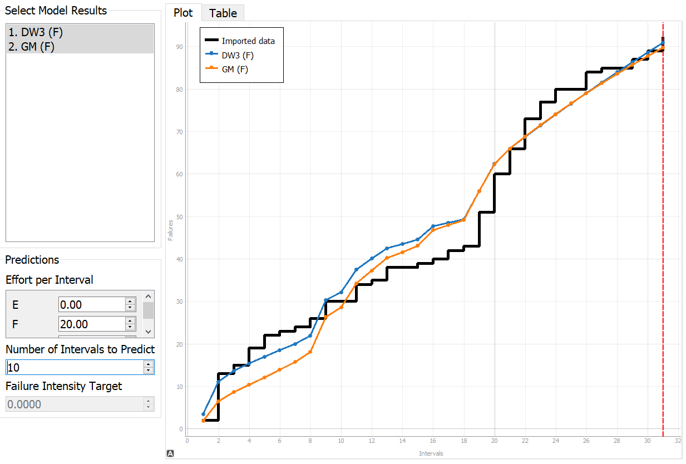
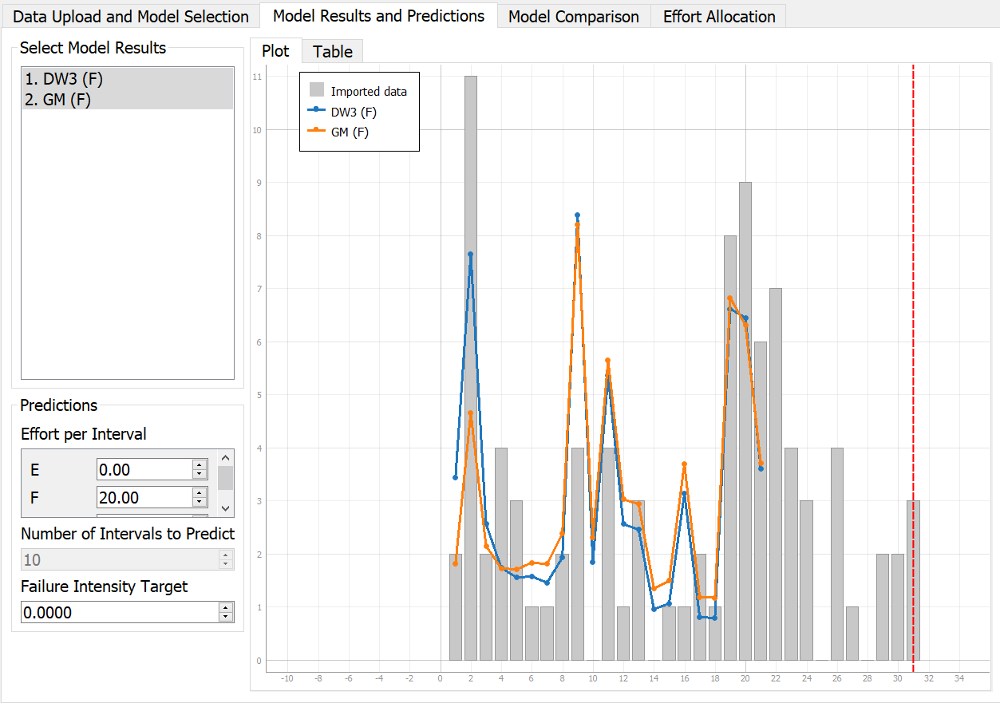

**SENG 637- Dependability and Reliability of Software Systems***

**Lab. Report \#5 – Software Reliability Assessment**

| Group:  8    |
|-----------------|
| Sepehr          |   
| Sara            |   
| Amir Hossein    |   
| Zahra           |
| Amir            | 

# Introduction

In this assignment we will explore the use of Reliability Growth Testing (RGT) and Reliability Demonstration Chart (RDC) to assess the reliability of a software system.

Then we will compare these techniques to see what they are like and how they are different from one another.

# Assessment Using Reliability Growth Testing 

For Reliability Growth Testing, after testing the tools suggested by the assignment guideline, we decided to utilize the tool C-SFRAT. The reason for choosing C-SFRAT is because the tool has a very user-friendly way to compare the models with different combinations of covariates.

For C-SFRAT, our approach was to first run the entire failure data set with every model and covariate combination possible, and then determine which model is suitable for the behavior of the failure data. See [model_comparison.csv](modified_artifacts/C_SFRAT_Model_Comparison.csv).

For comparing the models, we used Akaike's Information Criteria (AIC) and Bayesian Information Criteria (BIC) as these are computed by C-SFRAT, these are widely used in model selection. The model with the best AIC should explain the greatest amount of variation using the fewest possible independent variables, the lower the AIC score, the better[[1]](https://www.scribbr.com/statistics/akaike-information-criterion/).

BIC, on the otherhand, provides a good estimation on the performance of the model for future data, similar to AIC the lower the BIC score the better[[2]](https://stanfordphd.com/BIC.html).

After analyzing the Model Comparison tables from C-SFRAT, we determined that the Discrete Weibull Type 3 model, with covariate F is the best model, with AIC of 122.199 and BIC of 127.935. The second best is the Geometric Model with covariate F with AIC of 125.323 and BIC of 129.625.

After testing with the various ranges on these models, we found that using a subset of 21 of the 31 in the full set (approximately 67-70% of the full failure dataset) and setting the Covariate F as 20 efforts per interval gives best performance for the models.

One possible reason for this, is that from the 20th interval there is a huge up-climb of failures, and as such using only the subset before interval 20 will not effectively predict the failures with the models.

Time to Failure Plot of the two models:

Intensity Plot

As seen from the plot, the failure rate and mean time to failure (MTTF) for the original failure data and the predictions at the last interval (31) are:

| Dataset        | Failure Rate (F/Interval) | MTTF (intervals) |
| -------------- | ------------------------- | ---------------- |
| Raw Data       | 92/31 = 2.96              | 1/2.96 = 0.337   |
| DW3 Prediction | 91/31 = 2.94              | 1/2.94 = 0.341   |
| GM Prediction  | 90/31 = 2.90              | 1/2.90 = 0.344   |

Using interval 21 for DW3 and GM models to predict the last 10 intervals, the failure rate and MTTF are very close to the original failure data.

# Assessment Using Reliability Demonstration Chart 

The RDC-11 Excel sheet was used for plotting RDC graphs. As it was only configured to plot 16 failures it had to be modified for this data.

The default risk profile was used -

| Parameter                | Value |
| ------------------------ | ----- |
| Discrimination Ratio (γ) | 2     |
| Developer's Risk (α)     | 0.1   |
| User's Risk (β)          | 0.1   |

The failure data had to be modified before plotting. As the data was given as failures per interval, not time between failures. This was done by assuming failures were uniformly distributed in each interval. For example, if given data is

| T   | FC  |
| --- | --- |
| 1   | 2   |
| 2   | 3   |

Then it would be converted into time between failures as follows. At `T=1`, there are two failures, it can be assumed that one failure is at `T=0.5` and the other is at `T=1`.

| Cumulative Failure Count | Time between failures | Cumulative Time |
| ------------------------ | --------------------- | --------------- |
| 1                        | 0.5                   | 0.5             |
| 2                        | 0.5                   | 1               |
| 3                        | 0.33                  | 1.33            |
| 4                        | 0.33                  | 1.67            |
| 5                        | 0.33                  | 2               |

The converted data used for RDC can be found **[here](modified_artifacts/RDC_Failure_Data.xlsx)**.

# Comparison of Results

When comparing the results from both the Reliability Growth Testing and Reliability Demonstration Chart, we must use the same benchmark, and in this case, we use the MTTFmin defined from the Reliability Demonstration Chart section of 0.046 to assess the two results.

As determined by RDC, MTTFmin is 0.046, from the Reliability Growth section the MTTF of the SUT is 0.337, there for it would be considered acceptable. However, with the reliability demonstration chart, one can easily see when the observed failures cross into the reject or accept region, making RDC more efficient at determining if the SUT passes.

Overall, we believe that the two techniques are optimized for different things with the reliability growth testing specialized in predicting the behavior of failure trends and the Reliability Demonstration Chart specialize in the decision making of when testing can stop based on various risk factors.

# Discussion on Similarity and Differences of the Two Techniques

Similarities between Reliability Growth Testing (RGT) and Reliability Demonstration Chart (RDC) are as listed below.

#### Similarities

1. Both techniques are used to get the reliability statistics of the system.

2. Both rely on target failure rate or MTTF.

3. Both need failure data to work.

#### Differences

1. RGT is used to make reliability predictions based on existing failure data, whereas RDC is a way of checking whether the target failure rate is met or not in the existing failure data.

2. RGT uses failure curve models to make reliability predictions, whereas RDC uses risk profile to verify the reliability of the system.

3. RGT will simply make predictions based on the failure data and model selected, whereas RDC will determine if the SUT is acceptable based on risk profile.

# How the team work/effort was divided and managed

| Tester                   | Section                                                                          |
| ------------------------ | -------------------------------------------------------------------------------- |
| Amir                     | Assessment using RDC, RDC vs RGT, Difficulties & challenges, Comments & feedback |
| AmirHossein              | Assessment using RGT, RDC vs RGT, Difficulties & challenges, Comments & feedback |
| Zahra                    | Assessment using RDC, Difficulties & challenges, Comments & feedback             |
| Sara                     | Assessment using RGT, RDC vs RGT, Difficulties & challenges, Comments & feedback |
| Sepehr                   | Assessment using RDC, Difficulties & challenges, Comments & feedback             |

# Difficulties encountered, challenges overcome, and lessons learned

1. While choosing tools for reliability testing, we had some difficulties in getting the right tool for our project.

   - Our group first decided to test **SRTAT-SRE-tool**. This tool could import the sample data files but couldn't import the target data file. There wasn't any documentation available for the tool either, on how to use it and what input formats it supports. The [help page](http://www.dtic.mil/dtic/tr/fulltext/u2/a275405.pdf) (under Help menu) for the tool was not available either.

2. The given Reliability Demonstration Chart (RDC) data was not in accordance with the given failure data of the SUT. The RDC had to be significantly modified to accept the necessary number of data points for the given failure data. The modified RDC is [here](modified_artifacts/RDC.xlsm).

3. The RDC chart did not properly graph the accept/continue/reject regions, modifying the risk profile did not change the graph, as above the excel sheet had to be modified.

4. Failure data was not in the correct format for RDC. It was in the form of failures per interval, whereas the RDC sheet required that it be in time between failures.

5. To convert failures per interval to time between failures it was assumed that the failures were uniformly distributed in each interval. However, this is unlikely and therefore the results are likely inaccurate.

6. There was no target MTTF/FIO or risk profile for RDC provided. The default risk profile was assumed, however a different profile could significantly change the results. This also means that we can't fully determine if the SUT is accpetable.

# Comments/feedback on the lab itself

1. One of the recommended software **SRTAT-SRE-tool** is very hard to use. There is no documentation available for it as well.

2. The Reliability Demonstration Chart should have allowed input of all the failure data. It was very difficult to get it to properly graph the data.

3. There was very little documentation on the failure dataset.

